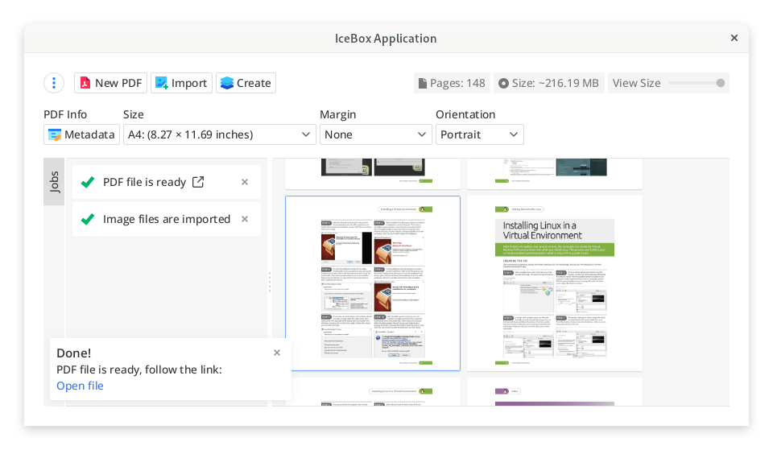
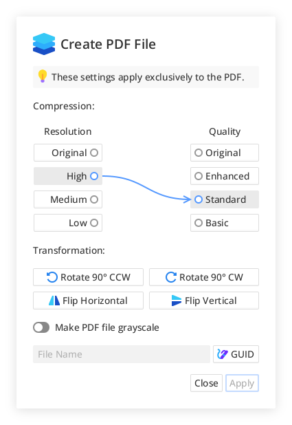

**IceBox** is a lightweight and intuitive desktop application for converting multiple images into a single, high-quality
PDF document. Built with Java, it runs seamlessly on Linux via Flatpak.

## ✨ Features

- 🖼️ Import various image formats, including JPEG, PNG, and JPEG 2000
- 📄 Convert images into a single PDF file
- 🧩 Built-in support for image compression and transformation
- 🌑 Option to generate grayscale PDF files
- 📝 Add metadata to your PDF output
- 🔧 Customize page margins, image size, and compression settings
- 🎛️ Clean, responsive, and user-friendly interface
- 🚀 Fast, lightweight, and easy to use

## 📦 Installation

### 🔹 From Flathub (Recommended)

> IceBox is available on Flathub. To install it, run the following command:

```bash
flatpak install flathub io.github.pleromix.IceBox
```

## 🚀 Running

> Once installed via Flatpak:

```bash
flatpak run io.github.pleromix.IceBox
```

## 📸 Screenshots

<div align="center" style="display: flex; width: 100%; justify-content: center; align-items: center;">
  
  
</div>

## 📄 License

> This project is licensed under the GPL-3.0 License.

## 👨‍💻 Author

> Developed with ❤️ by [Pleromix](https://github.com/pleromix).
> If you find this project useful, consider giving it a ⭐ on GitHub!

